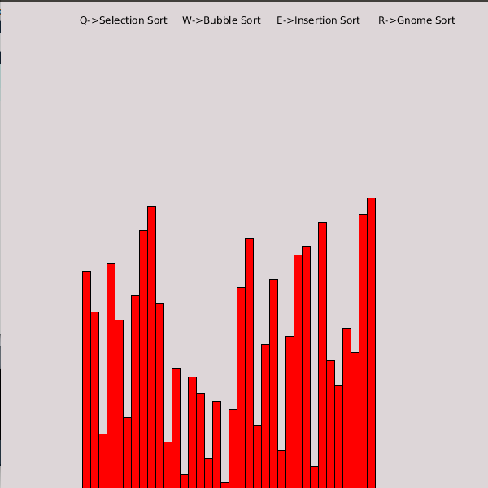
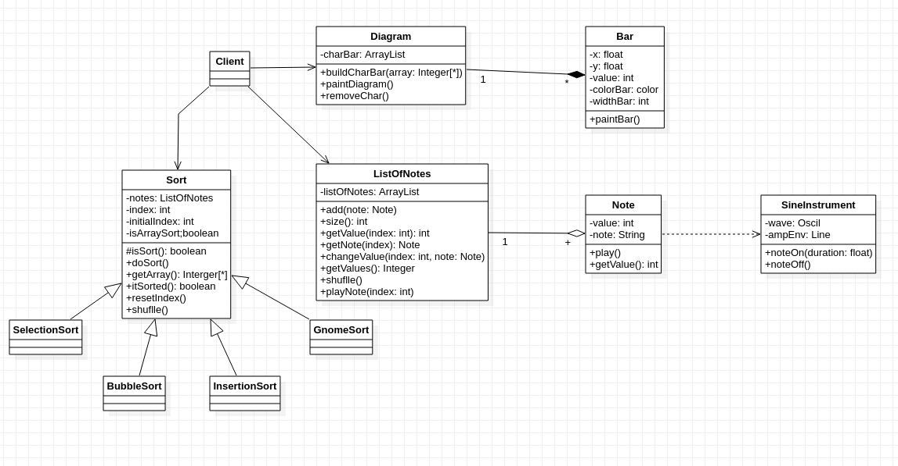

# Sound-Processing


## Autor
Miguel Ángel Medina Ramírez <br>
Correo: miguel.medina108@alu.ulpgc.es

## Indice
1. [Introducción](#introducción)
2. [Dependencias](#dependencias)
3. [Implementación](#implementación) <br>
    3.1 [Diagrama](#diagrama)<br>
    3.2 [Algoritmo de Ordenación](#algoritmo-de-ordenación)<br>
    3.2 [Sonido](#Sonido)<br>
4. [Eventos](#eventos)
5. [Bibliografía](#bibliografía)

## Introducción
Para esta práctica se ha hecho una integración de los componentes de sonido y gráficos que disponen processing.El objetivo es comprobar como suenan algunos algoritmos de ordenación, para ello se ha escogido parte de una sonate de piano, donde sus notas se asignarán a un vector de enteros, cada vez que algún algoritmo inicié un cambio en el orden de los elmentos sonará la nota asignada.

## Dependencias
Para poder ejecutar y probar la práctica solamente se necesita clonar este repositorio y el editor de processing con las siguientes dependencias:
- La librería **sound** para poder reproducir sonidos. Su instalación se encuentra en la documentación de la práctica.

## Implementación

Para hacer el diseño de clases todos los algoritmos de ordenación se encuentran bajo una misma clase abstracta y las notas se implementan mediante una lista, asimismo la interfaz se muestra como un diagrama de barras que se va movimiendo conforme los algoritmos actuen en él haciendo sonar una nota en cada movimiento o dezplazamiento

<p align="center">
  
</p>
<p align="center">
  Figura 1: Imagen de muestra
</p>
<br>

### Diagrama

<p align="center">
  
</p>
<p align="center">
  Figura 2: Diagrama UML
</p>
<br>

### Algoritmos de Ordenación

Se han elegido cuatro algoritmos básicos, se ha añadido además un delay a cada ciclo de ejecución para que suene mejor el algoritmo.

```java
public Sort(ListOfNotes notes, int index){
    this.notes        = notes;
    this.index        = index;
    this.initialIndex = index;
    this.isArraySort  = isSort();
  }
  
  protected boolean isSort(){
    for(int i = 0; i < notes.size()-1; i++){
      if(notes.getValue(i) > notes.getValue(i+1)){
        return false;
      }
    }
    return true;
  }
  
  public abstract void doSort();
  
  public Integer[] getArray(){
    return notes.getValues();
  }
  
  public boolean itSorted(){
    return isArraySort;
  }
  
  public void resetIndex(){
    index = initialIndex;
  }
  
  
  public void shuflle(){
    notes.shuflle();
    index            = initialIndex;
    this.isArraySort = isSort();
  }
}
```

#### Selection Sort
El algoritmo por selección clasifica un vector al encontrar repetidamente el elemento mínimo (considerando el orden ascendente) de la parte no ordenada y colocarlo al principio. El algoritmo mantiene dos subvectores en un vector determinada.

1) El subvector que ya está ordenada.
2) Subvector restante que no está ordenada.

En cada iteración del orden de selección, el elemento mínimo (considerando el orden ascendente) del subconjunto no ordenado se selecciona y se mueve al subconjunto ordenado.

**Complejidad del tiempo**: O(n²) ya que hay dos bucles anidados.

```java
class SelectionSort extends Sort{
  
  public SelectionSort(ListOfNotes notes){
    super(notes,0);
  }
  
  public void doSort(){
    if(!isArraySort){
      int min_idx = index; 
      for (int j = index+1; j < notes.size(); j++) 
          if (notes.getValue(j) < notes.getValue(min_idx)) min_idx = j;
      Note temp = notes.getNote(min_idx); 
      notes.changeValue(min_idx,notes.getNote(index));
      notes.changeValue(index,temp);
      index++;
      isArraySort = isSort();
    }
    isArraySort = isSort();
  }
}
```

#### Bubble Sort

Bubble Sort es el algoritmo de clasificación más simple que funciona intercambiando repetidamente los elementos adyacentes si están en orden incorrecto.

**Complejidad del tiempo**: O(n²), existe otras versiones optimizadas.

```java
class BubbleSort extends Sort {
  
  public BubbleSort(ListOfNotes notes){
    super(notes,0);
  }
  
  public void doSort(){
    if(!isArraySort){
      for (int j = 0; j < notes.size()-index-1; j++){ 
        if (notes.getValue(j) > notes.getValue(j+1)){ 
            Note temp = notes.getNote(j); 
            notes.changeValue(j,notes.getNote(j+1));
            notes.changeValue(j+1,temp);
        } 
      }
      index++;
     
    }
    isArraySort = isSort();
  }
}
```

#### Insertion Sort

La ordenación por inserción es un algoritmo de ordenación simple que funciona de la forma en que ordenamos las cartas en nuestras manos.

**Complejidad del tiempo**: O(n²)

```java
class InsertionSort extends Sort {
  
  public InsertionSort(ListOfNotes notes){
    super(notes,1);
  }
  
  public void doSort(){
    if(!isArraySort){
      Note keySort = notes.getNote(index); 
      int j = index - 1;

      while (j >= 0 && notes.getValue(j) > keySort.getValue()) { 
          notes.changeValue(j+1,notes.getNote(j));
          j = j - 1;
      }
      notes.changeValue(j+1,keySort);
      index++;
    }
    isArraySort = isSort();
  }
}
```

#### Gnome Sort

Gnome Sort también llamado Stupid sort se basa en el concepto de un Garden Gnome que clasifica sus macetas. Un gnomo de jardín clasifica las macetas con el siguiente método:

 * El Gnomo mira la maceta más cercana y la anterior; si están en el orden correcto, avanza hacia adelante; de ​​lo contrario, los intercambia y retrocede.

  * Si está en la primera maceta (está al comienzo de la lista) y  se adelanta; Si no está en la primera maceta  (está al final).

**Complejidad del tiempo**: O(n²)

```java
class GnomeSort extends Sort {
  
  public GnomeSort(ListOfNotes notes){
    super(notes,0);
  }
  
  public void doSort(){
    if(!isArraySort){
      if (index == 0) index++; 
      if (notes.getValue(index) >= notes.getValue(index - 1)) {
          index++; 
      } else { 
          Note temp = notes.getNote(index); 
          notes.changeValue(index,notes.getNote(index - 1));
          notes.changeValue(index - 1,temp);
          index--;
      }
    }
    isArraySort = isSort();
  }
}
```

### Sonido

Cada nota tiene asociado el elemento a ordenar y una nota músical y para implementar el sonido se ha elegido un piano para ser de instrumento.

```java
class Note {
  private int value;
  private String note;
  
  public Note(int value, String note){
    this.value = value;
    this.note = note;
  }
  
  public void play(){
    out.playNote(0.0, 0.9, new SineInstrument( Frequency.ofPitch(note).asHz() ) );  
  }
  
  public int getValue(){
    return value;
  }
  
}


class SineInstrument implements Instrument {
  private Oscil wave;
  private Line  ampEnv;
 
  public SineInstrument(float frequency){
    wave   = new Oscil( frequency, 0, Waves.SINE);
    ampEnv = new Line();
    ampEnv.patch(wave.amplitude);
  }
  
  public void noteOn( float duration ){
    ampEnv.activate(duration, 0.5f, 0);
    wave.patch(out);
  }
  
  public void noteOff(){
    wave.unpatch(out);
  }
}
```

## Eventos

<table style="width:100%">
  <tr>
    <th>Tecla</th>
    <th>Uso</th>
  </tr>
  <tr>
    <td>Q</td>
    <td>Ordenar con Selection Sort</td>
  </tr>
  <tr>
    <td>W</td>
    <td>Ordenar con Bubble Sort</td>
  </tr>
  <tr>
    <td>E</td>
    <td>Ordenar con Insertion Sort</td>
  </tr>
  <tr>
    <td>R</td>
    <td>Ordenar con Gnome Sort</td>
  </tr>
  <tr>
    <td>S</td>
    <td>Distribuir los datos del vector aleatorimente</td>
  </tr>
</table>

## Bibliografía

* [Guion de prácticas](https://cv-aep.ulpgc.es/cv/ulpgctp20/pluginfile.php/126724/mod_resource/content/22/CIU_Pr_cticas.pdf)
* [processing.org](https://processing.org/)
* [Sonata de Piano](https://pianoletternotes.blogspot.com/2019/05/giornos-theme-jojos-bizarre-adventure.html)
* [Algoritmos de Ordenación](https://www.geeksforgeeks.org/sorting-algorithms/)